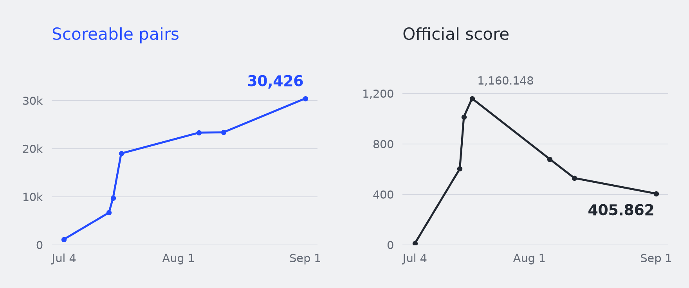
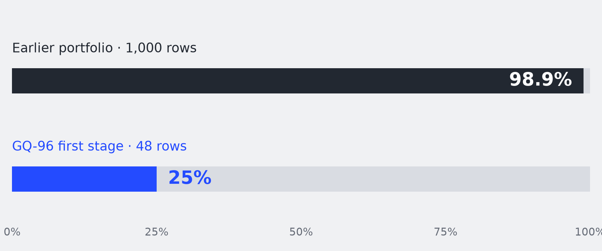

# Two Batchmates Walk Into a Maths Competition

**Team Dirac’s IGP24 research archive — constructions, code, polynomials, experiments, and the conversations behind them.**

I’m Aishwarya Das, the founder of Dirac Labs. My day job is building quantum sensors. Durgesh Kumar was my batchmate in undergrad; he is preparing to start a PhD in category theory. For close to a month, we worked together on a mathematics competition that asked a deceptively simple question: **can you find an equation with these particular symmetries?**

Durgesh suggested the mathematical structures worth exploring. I worked with GPT‑5.6 Pro to develop and question the plans, passed the resulting briefs to Codex, and ran the larger searches on Google Cloud. We kept the results, including the ones that told us to stop.

The published September 1, 2026 leaderboard placed **Dirac 14th, with 30,426 scoreable group/signature pairs and 405.86189 points**. This repository lets you look past that number: at the equations we submitted, the methods we tried, the checks we used, and one strategy conversation that led to a different experiment.

[Read the illustrated essay](article/essay.md) · [Reproduce an example](examples/f5/README.md) · [Browse the pair index](data/pairs.csv) · [Read the Pro conversation and handoffs](conversations/README.md) · [Download the full corpus](https://github.com/ash9241/team-dirac-igp24/releases/tag/v1.0.0)



*Seven dated observations, July 4–September 1. The lines connect checkpoints, not daily measurements. The records extend beyond our period of active work. [Underlying data and sources](evidence/selected_checkpoints.csv).*

## What was the problem?

The polynomial $x^2-2$ has roots $\sqrt{2}$ and $-\sqrt{2}$. Exchanging them preserves their algebraic relationships over the rational numbers. Together with doing nothing, that exchange forms its Galois group.

The inverse Galois problem asks for the equation when you start with the group. IGP24 focused on degree 24: monic, irreducible polynomials with integer coefficients, labeled by their group `24Tt` and their number of real roots `r`. A target is the pair `(24Tt, r)`.

There are **25,000** transitive permutation groups in this degree and **165,836** allowed group/real-root targets. The competition’s frozen LMFDB baseline contained **622** pairs across **286** group labels. An existence theorem can tell us that a group occurs without providing the explicit coefficient list that another researcher can calculate with. The competition asked people to produce those lists. [Official overview](https://competition.sair.foundation/competitions/igp24/overview).

Our result does not solve the general inverse Galois problem. A pair is not a distinct group, and an accepted example is not automatically an exclusive discovery or a new existence theorem. Rank 14 is our competition placement, not a ranking of mathematicians.

## What is here?

| Material | What you can inspect |
|---|---|
| [Illustrated essay](article/essay.md) | The story, polynomial, scoring explanation, measured graphs, and generated illustrations |
| [Results and data dictionary](data/README.md) | All exported local submission rows, a searchable representative for each locally accepted pair, and the coverage reconciliation |
| [F5 worked example](examples/f5/README.md) | A source polynomial, the construction, exact output coefficients, an action certificate, a saved official receipt, and a runnable arithmetic replay |
| [Experiment evidence](evidence/README.md) | The 1,000-row quartic postmortem, the 48-row pilot, F5/F6 receipts, and zero-hit runs |
| [Pro conversations and handoffs](conversations/README.md) | The recovered user-visible chat, complete saved implementation brief, later strategy report, and prompts |
| [Research source](research/README.md) | Construction families, GAP/Sage/PARI workers, the ledger, scheduler, submission/reconciliation code, and historical tests |
| [Workflow and failure ledger](docs/workflow.md) | Human/model roles, goal loops, decision rules, and what did not work |
| [Environment and verification](docs/reproducing.md) | Commands that were checked for this release and the limits of those checks |

### The local corpus and the final leaderboard are different records

The exported local ledger contains **1,833,772 submitted polynomial rows across 3,238 submissions**. Of those, **1,680,129** have saved accepted verification records, covering **30,288 distinct pairs and 8,521 group labels**. Another **153,625** rows have no verification in this local snapshot; **18** have saved failure records. Missing verification is preserved as missing.

The final leaderboard’s **30,426 scoreable pairs** is a later competition record. The local scoring flags are older: they mark 25,724 distinct pairs scoreable and retain pending states for other accepted rows. Those flags must not be used to reconstruct the final score. Of 30,421 retrieved public placement rows, 29,939 have a local accepted representative and 482 do not. The public API itself returns five fewer pairs than its 30,426-pair headline. [Data coverage](data/README.md) records these differences explicitly.

The corpus release contains all 1,833,772 local rows, including repeats and unresolved rows. It is split into ten compressed CSV files, approximately 324 MB in total, attached to [release v1.0.0](https://github.com/ash9241/team-dirac-igp24/releases/tag/v1.0.0). A normal clone includes the smaller representative dataset and pair index. [File hashes and row counts](data/local-corpus-summary.json) make the downloads checkable.

## Try one result

Clone the repository and inspect a representative using only Python’s standard library:

```sh
git clone https://github.com/ash9241/team-dirac-igp24.git
cd team-dirac-igp24
python3 scripts/lookup_pair.py 24T15308 20
python3 scripts/validate_release.py
```

To reconstruct the example, install [PARI/GP](https://pari.math.u-bordeaux.fr/) and run:

```sh
python3 examples/f5/replay_example.py --gp gp
```

Start with an accepted source of the form $q(x^2)$, where $q$ has degree 12. Form the 66 unordered pairwise products of the twelve roots of $q$. The polynomial with those products as roots factors over the rationals into degrees **6, 12, and 48**. Take the unique degree-12 factor $h$ and form $h(x^2)$:

$$
\begin{aligned}
f(x)={}&x^{24}-65x^{22}-919x^{20}+99\,720x^{18}\\
&-2\,091\,889x^{16}+20\,925\,521x^{14}-115\,387\,013x^{12}\\
&+361\,770\,394x^{10}-629\,434\,912x^{8}+562\,276\,089x^{6}\\
&-201\,494\,301x^{4}-10\,640\,675x^{2}+15\,405\,625.
\end{aligned}
$$

The saved competition receipt identifies this as **24T15308 with 20 real roots**. The replay reconstructs its coefficients and checks degree, irreducibility, and real-root count with PARI/GP. **It does not rerun Magma’s Galois-group identification.** The group label, archived action certificate, and arithmetic replay are separate pieces of evidence. [Complete example and receipt](examples/f5/evidence/worked_example.json).

## A thousand accepted answers taught us what to change

One portfolio produced **1,000 accepted polynomials**, but **989** fell into only three group labels. We had varied coefficients while preserving restrictive structure: the four main templates were even quartics over sextic fields.

The useful question became why these formulas kept returning the same families. We gave Pro the formulas and returned labels. Its response focused on the constraints imposed by even quartics and proposed a general-quartic pilot, with explicit stop/go thresholds. I asked for the plan as a Markdown file so Codex could implement it.



The first stage of GQ‑96 returned **48 accepted rows across 14 group labels and 48 distinct pairs**. Its three most common labels contained **12 rows**, or **25%**. An early checkpoint recorded 16 pairs new to our team while scoring was still pending; a later saved receipt marked all 48 rows scoreable. These quantities describe different stages of the experiment.

This comparison uses selected batches of different sizes and dates. It is not a controlled measurement of a model’s effect. What we can show is the sequence: the original formulas, the collapse in the returned labels, the strategy brief, the implementation, and the pilot result. [Evidence](evidence/README.md) · [Saved Pro brief](conversations/handoffs/2026-07-17-pro-implementation-brief.md).

Other routes reused accepted fields. The F5/F6 reconstruction matches **49 distinct accepted pairs** to receipts: 35 from F5 and 14 from F6. The 156 F5 resolutions quoted in an early retrospective cover selected productive waves. We also found five additional zero-hit summaries covering 54 resolutions. This archive preserves both; 35/156 should not be presented as a campaign-wide success rate.

## What the harness did

The loop was: choose a construction, generate a small batch, check it locally, submit selected candidates, reconcile the returned results, and decide whether to expand or change the search.

Durgesh supplied mathematical direction. Pro helped examine assumptions and turn the current evidence into proposed experiments. Codex helped implement and revise them. I managed the handoffs and compute. SageMath, GAP, PARI/GP, and the competition verifier supplied mathematical checks; a model’s prediction was not an acceptance receipt.

Codex `/goals` helped sustain work across repeated attempts. The useful goals specified an object to build, a testable criterion, a budget or stopping condition, and a durable record of what happened. The scripts and notebooks show how these constraints evolved. This was human-mediated orchestration: I moved briefs and results between Pro, Codex, Durgesh, and the machines. We do not have a complete model-tagged transcript of every execution.

Hill climbing here often meant improving the **search procedure**: selecting better construction families, reallocating compute, trying different actions on roots, and recognizing saturation. Small coefficient changes do not give a smooth mathematical landscape. A family can yield many valid polynomials while making almost no progress on the targets we need. [Workflow, examples, and limitations](docs/workflow.md).

## Why more pairs did not guarantee more points

For a credited pair, the scoring formula is

$$w=2^{1-k}\frac{\log D_0}{\log D}.$$

Here $k$ is the number of credited teams, $D$ is the team’s best official scoring discriminant, and $D_0$ is the smallest among credited teams. An exclusive non-baseline pair earns 1 point. Each additional credited team halves the sharing factor. A baseline pair requires a strict improvement on its exact field discriminant; the baseline then counts as an additional team. The rules specify exact and mixed-discriminant treatment. [Evaluation rules](https://competition.sair.foundation/competitions/igp24/evaluation-setup).

Between our August 6 checkpoint and the September 1 table, credited coverage increased by **7,108 pairs** while the score decreased by approximately **273.812 points**. Competition, discriminants, and score recomputation all matter; the aggregate curve does not isolate their separate effects.

## Provenance and reuse

This is a curated publication snapshot of our working material. The original workspace and Git history were not pushed. Release copies remove private machine paths, omit credentials and raw operational logs, and replace the legacy API client’s credential-file lookup with an explicit environment variable. Historical scripts retain their research context and are not all portable, independently certified applications.

The Pro transcript contains a clearly marked truncated message; its missing text has not been reconstructed. Complete saved strategy artifacts are provided separately. Some historical notes make stronger claims than the later audit supports. The README, data dictionary, and evidence notes explain the corrections.

Team-authored code is available under the [MIT license](LICENSE). See [NOTICE](NOTICE.md) for data, writing, generated images, external mathematical software, and seed provenance. Please cite the archive using [CITATION.cff](CITATION.cff), and include the release version or commit when discussing a result. Corrections and independently reproduced examples are welcome through [issues](https://github.com/ash9241/team-dirac-igp24/issues).

**Aishwarya Das and Durgesh Kumar — Team Dirac, September 2026.**
