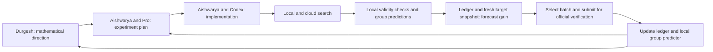

# How we worked

## Roles and handoffs

Durgesh Kumar proposed mathematical constructions and the families of fields worth exploring. Aishwarya Das turned those ideas into executable work with Codex, organized the larger Google Cloud searches, and carried results back into the discussion. GPT‑5.6 Pro helped review the strategy, challenge explanations, and write the implementation briefs.

The handoff was usually a document. It collected the formulas, what the last run returned, the next bounded experiment, and what would justify scaling it. It did not give Pro a direct, autonomous connection to the cloud. Aishwarya mediated the exchange.

## The harness

The research code accumulated several generations of the same operational idea:

1. **Name a construction.** Record a base field, parameters, predicted action, and desired signature. A proposed group label is a hypothesis until justified.
2. **Generate a bounded portfolio.** Vary structure deliberately. Record the recipe and coefficient hash so an output can be traced back.
3. **Apply cheap local checks.** Validate coefficient format, degree, monicity, irreducibility, and real-root count where the chosen tools support them.
4. **Forecast gain against a fresh target snapshot.** The ledger tracks candidates, submissions, verified pairs, team counts, and the best known scoring discriminants. The scheduler combines these with label confidence and estimated discriminant quality to rank expected value before submission. It filters out owned pairs; the controller's marginal forecast discounts repeated attempts at one target. A new coefficient string, a new field, and a new pair are different things.
5. **Stage and submit selected candidates.** Keep manifests and receipts. The control client records ambiguous submission outcomes so a retry does not silently duplicate work.
6. **Reconcile results.** Official results update the ledger and provide verified fingerprint/label examples for the local group predictor. A locally generated polynomial, an accepted verification, and a scoreable pair are separate states. Delayed scoring should stay pending.
7. **Review the family.** Count distinct pairs and labels, concentration, runtime, and estimated retained value. Expand a useful family or change the construction when it saturates.

The implementations are in [the local validity gates](../research/routeA/submit_exploration_batch.py), [ledger](../research/routeA/ledger.py), [scheduler](../research/routeA/scheduler.py), [controller](../research/routeA/controller.py), [API client](../research/routeA/api_client.py), and [autoresearch source](../research/igp24_autoresearch/). The [research runbook](../research/IGP24_Rank_Climbing_System.md) describes the group predictor and its updates from official labels. Local predictions guide selection; an unproved group label remains a prediction until verified. Their historical defaults reflect an active competition; the release’s quick-start commands only read archived data or run local arithmetic.

## What a useful goal contained

Aishwarya used Codex `/goals` to sustain repeated attempts. The records support a practical distinction between a goal such as “improve our rank” and one that names a construction, an output, checks, and a stopping condition. The second gives an agent something concrete to execute and lets the humans judge the result.

The July 17 brief, for example, proposes a 96-field general-quartic experiment in two stages of 48. Its gates concern distinct labels, new team pairs, points, concentration, and the marginal yield of the next batch. The first recorded 48-row result can be compared with those proposed gates. Later plans add retained-value estimates and explicit lists of exhausted approaches.

The [rank-climbing system](../research/IGP24_Rank_Climbing_System.md), [July 27 handoff](../research/igp24_autoresearch/IGP_SESSION_HANDOFF_20260727.md), and [approach registry](../research/igp24_autoresearch/APPROACH_REGISTRY_20260727.md) document this progression. They are historical planning records, not complete transcripts of each `/goal` invocation. We have not reconstructed missing prompts or model metadata.

## What we learned from failures

| Observation | What it changed | Evidence and scope |
|---|---|---|
| 989 of 1,000 accepted rows landed in three labels | Inspect the algebraic restrictions in the templates; change structure before scaling coefficients | [Even-quartic forensic record](../evidence/quartics/cross2000_even_quartic_forensic.json); 11 labels in the full 1,000-row cohort |
| The general-quartic pilot spread 48 rows across 14 labels | A different construction could explore more broadly; continue measuring novelty and concentration | [Verified pilot rows](../evidence/verified_metrics.json); an observational comparison of selected cohorts |
| Five additional F5 summaries contained zero hits across 54 resolutions | Productive waves were an incomplete denominator; preserve dead ends alongside successes | [F5 summaries](../evidence/f5/) and [audited totals](../evidence/verified_metrics.json) |
| More credited pairs accompanied a lower score | Track the value of the portfolio as competitors and discriminants change | [Seven checkpoints](../evidence/selected_checkpoints.csv); no attribution of the whole decline to a single cause |
| Verification and scoring continued after local syncs | Preserve pending/unknown states and compare dated snapshots explicitly | [Corpus summary](../data/local-corpus-summary.json) and [coverage report](../data/coverage.json) |

The early F5 retrospective’s 35/156 ratio refers to selected productive waves. Its submission window excludes prior research, generation, precomputation, and later verification latency. Neither quantity measures the entire campaign’s efficiency. Historical “gold” means a nomination against a particular target snapshot; it does not establish exclusivity today or priority in mathematics.

## Where hill climbing helps—and where the analogy stops

Ordinary hill climbing evaluates nearby candidates and retains improvements. Here the most meaningful neighborhood was often a family of constructions: changing a relative extension, an action on roots, a sign pattern, or a field used as a seed. A small coefficient perturbation could destroy irreducibility, preserve an unhelpful group, or change the group abruptly.

We also searched over the procedure itself. A pilot exposed concentration; the next plan changed the construction; a better result justified more effort in that family. Restarts, portfolio allocation, and target-directed search mattered alongside local improvement. “Hill climbing” describes part of the workflow, not a proof that the objective is smooth or that every step gets closer to a theorem.

IGP24 supplied many independently checkable targets, so intermediate feedback could be useful. Other mathematical questions may admit iterative formulations through examples, counterexamples, bounds, or auxiliary lemmas. Finding a useful formulation can itself be the hard mathematical work. There is no sharp, universal division of mathematics into climbable and non-climbable problems.

The archive is evidence of what this collaboration produced. It is not a controlled comparison that isolates the contribution of a model, prompt, or cloud budget.
